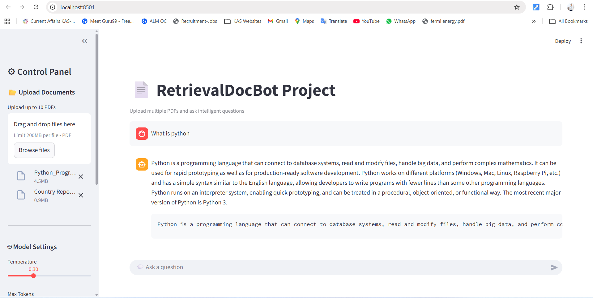
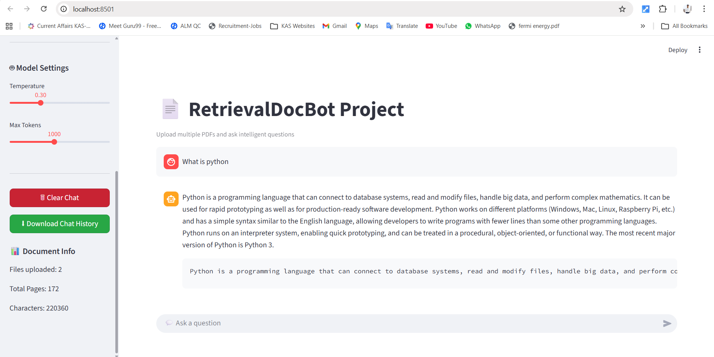

# Retrieval-Doc-Bot

# Retrieval Doc Bot | AI-Powered Document Chatbot

An AI-powered Retrieval-Augmented Generation (RAG) chatbot that enables intelligent question answering from uploaded PDF documents using semantic search and large language models.

## Project Overview

Retrieval Doc Bot allows users to upload multiple PDF files and ask context-aware questions. The system retrieves relevant document chunks using vector similarity search and generates accurate answers based on the uploaded content.

This project demonstrates an end-to-end RAG pipeline using LangChain, OpenAI, FAISS, pdfplumber, and Streamlit.

## Key Objectives

- Build an AI-powered document question-answering system
- Enable intelligent retrieval of document-based information
- Improve search accuracy using vector embeddings
- Provide real-time conversational responses
- Simplify document analysis and knowledge extraction
- Implement Retrieval-Augmented Generation (RAG)

## Features

- Upload PDF documents
- Extract text from uploaded files
- Generate embeddings for semantic search
- Store document chunks in a vector database
- Retrieve relevant context from documents
- Generate context-aware AI responses
- Display document statistics
- Provide an interactive Streamlit chat interface
- Download full chat history
- Clear chat history
- Adjust model parameters

## Tools & Technologies Used

| Technology | Purpose |
| --- | --- |
| Python | Backend logic |
| Streamlit | Web interface |
| LangChain | RAG pipeline |
| OpenAI API | LLM and embeddings |
| FAISS | Vector similarity search |
| pdfplumber | PDF text extraction |

## How It Works

1. User uploads PDF documents.
2. Text is extracted using pdfplumber.
3. Text is split into chunks using LangChain.
4. OpenAI embeddings convert chunks into vectors.
5. FAISS stores vectors for semantic retrieval.
6. Relevant chunks are retrieved using MMR search.
7. Retrieved context is passed to the language model.
8. The model generates an answer based on the provided context.

## Application Interface

Below is the interface of the Retrieval Doc Bot RAG chatbot built using Streamlit.





## Project Demo

[Download and watch the demo](demo/rag-demo.mp4)

## Installation & Setup

### 1. Clone Repository

```bash
git clone https://github.com/rutika-oss/Retrieval-Doc-Bot.git
cd Retrieval-Doc-Bot
```

### 2. Create Virtual Environment

```bash
python -m venv venv
```

### 3. Activate Virtual Environment

Windows:

```bash
venv\Scripts\activate
```

Mac/Linux:

```bash
source venv/bin/activate
```

### 4. Install Dependencies

```bash
pip install -r requirements.txt
```

### 5. Add OpenAI API Key

Create a file named `config.py` and add:

```python
OPENAI_API_KEY = "your_openai_api_key_here"
```

You can also keep secrets in a local `.env` file if you adapt the configuration for environment variables.

### 6. Run Application

```bash
streamlit run main.py
```

## Project Structure

```text
Retrieval-Doc-Bot/
├── demo/
│   └── rag-demo.mp4
├── images/
│   ├── rag-ui.png.png
│   └── rag-ui2.png.png
├── .gitignore
├── main.py
├── README.md
└── requirements.txt
```

## Learning Outcomes

- Built a complete Retrieval-Augmented Generation pipeline
- Implemented semantic search using FAISS
- Worked with OpenAI embeddings and GPT models
- Applied prompt engineering
- Designed an interactive AI application
- Implemented session-based chat history management

## Future Enhancements

- Persistent vector database storage
- User authentication system
- Multi-user chat support
- Source highlighting in answers
- Cloud deployment

## Acknowledgements

Special thanks to mentors, open-source communities, and online learning platforms for guidance and support throughout this project.

## About Me

I am passionate about Artificial Intelligence, Machine Learning, and Data Analytics with strong interest in building real-world AI applications and interactive dashboards.

Email: manerutika48@gmail.com

LinkedIn: www.linkedin.com/in/rutika-mane-121a0526a

Continuously learning, building, and exploring opportunities in AI, Machine Learning, and Data Analytics.

#Python #AI #MachineLearning #RAG #LangChain #Streamlit #OpenAI #Chatbot #DataScience #ArtificialIntelligence
